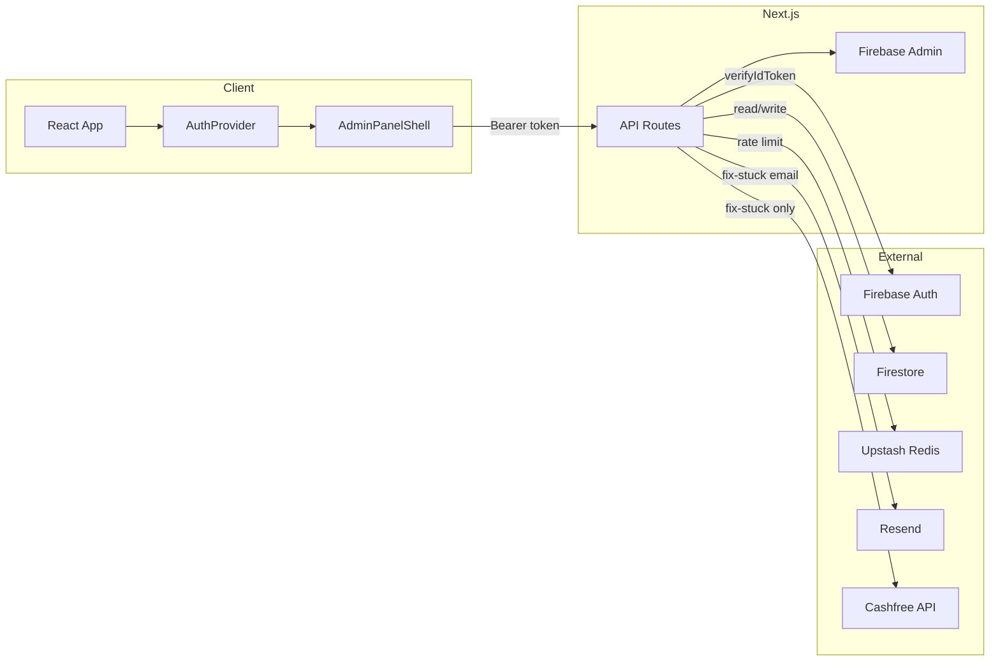

# Architecture

This document describes the system design, frontend and backend architecture, authentication, authorization, and data flow for the Admin Dashboard.

## High-Level System Design

The application is a single Next.js app. There is no separate backend service; API route handlers run in the same deployment and use Firebase Admin SDK for Auth and Firestore.

- **Client:** React with AuthProvider and AdminPanelShell. All authenticated API calls send the Firebase ID token as `Authorization: Bearer <token>`.
- **API routes:** Next.js App Router route handlers. They enforce rate limiting (when Redis is configured), then auth (requireOrganizer / requireAdminRole), then Firestore and optional external calls.
- **Firebase:** Auth for token verification; Firestore for all persistent data (users, payments, passes, teams, events, admin_dashboard, admin_logs).
- **Resend / Cashfree:** Used only in the fix-stuck-payment flow (email and Cashfree Orders API).

## Frontend Architecture

### App Router Structure

- **Root layout** (`app/layout.tsx`): Wraps the app with `AuthProvider` and `AdminLayout`; loads `globals.css` and `admin.css`; dark theme.
- **AdminLayout** (`app/AdminLayout.tsx`): If pathname is `/signin`, renders children only. Otherwise wraps with `AdminPanelShell` (sidebar + main content).
- **Routes:**
  - `/` — Overview dashboard (`app/page.tsx` → `OverviewContent`).
  - `/signin` — Sign-in page (Google).
  - `/admin/*` — All admin pages (financial, operations, unified, live-checkin, passes, payments, users, teams, events, audit-logs). Each area has its own `page.tsx` and optionally `layout.tsx`.

### Data Fetching

- **Server components:** Used for layout and static structure; no direct Firestore from server components for admin data.
- **Client components:** Fetch data via `fetch()` with the Firebase ID token in `Authorization: Bearer <token>`. Examples: `hooks/use-me-role.ts`, `hooks/use-payments.ts`, `hooks/use-users.ts`.
- **Client cache:** `lib/clientCache.ts` — in-memory TTL cache (default 10 minutes) to avoid redundant API (and rate-limit) hits. Mutations should call `invalidateCache(key)` or `invalidateCachePrefix(prefix)` so the next read is fresh.

### Role and Access (Frontend)

- **Organizer:** `users/{uid}.isOrganizer === true` is required to access any admin UI. Enforced in `AdminPanelShell`: if not loading and (!user or !userData?.isOrganizer), redirect to `/signin`.
- **Admin role:** `users/{uid}.adminRole` is one of `viewer` | `manager` | `superadmin`. Fetched via `GET /api/me` and exposed through `useMeRole` and `userData.adminRole`. Used to:
  - Show/hide Financial view (superadmin only).
  - Enable/disable mutation actions (viewer = read-only; manager = passes/teams; superadmin = also users/payments/events).

Auth and role checks are enforced in the API; the UI only hides or disables features based on role.

## Backend Architecture

- **Route handlers only:** Admin mutations use POST/PATCH/DELETE route handlers. There are no server actions used for admin data mutations.
- **Pattern per route:**  
  1. (Optional) Rate limit (middleware and/or route-level `rateLimitAdmin`).  
  2. Auth: `requireOrganizer(req)` or `requireAdminRole(req)`.  
  3. Role check where needed (e.g. financial view or update-payment).  
  4. Read/write Firestore (and optionally call Cashfree, Resend).  
  5. Optionally write to `admin_logs` for mutations (via `logAdminAction` in `lib/admin/adminLogger.ts`).

**Firestore collections used:**

- `users` — Profiles and organizer/admin role.
- `payments` — Payment records (linked to Cashfree by order ID).
- `passes` — Pass records (one per successful payment; QR, status, usedAt, etc.).
- `teams` — Team data (group events).
- `events` — Event metadata.
- `admin_dashboard` — Read-optimized aggregated docs per user (built by `lib/admin/buildAdminDashboard.ts`).
- `admin_logs` — Audit log entries (sensitive fields redacted).

## Authentication Model

- **Method:** Firebase Authentication with **Google sign-in** only (`features/auth/authService.ts`: `signInWithGoogle()`).
- **Session:** No server-side session store. The client holds the Firebase user; when calling the API it gets an ID token with `user.getIdToken()` and sends it as `Authorization: Bearer <idToken>`.
- **Server verification:** Each protected route uses `requireOrganizer(req)`, which:
  1. Reads the Bearer token from the request.
  2. Calls Firebase Admin `getAdminAuth().verifyIdToken(idToken)`.
  3. On success, returns `{ uid }`; on failure, returns 401 JSON (e.g. "Session expired" for expired token).

Token refresh is handled on the client (e.g. `useMeRole` retries with a fresh token on 401).

## Authorization Model

- **Organizer:** After token verification, the server reads `users/{uid}` and requires `isOrganizer === true`. If not, responds with 403 "Organizer access required".
- **Admin roles:** Stored in `users/{uid}.adminRole`: `viewer` | `manager` | `superadmin`. Default in code when the field is missing: **viewer** (`lib/admin/adminRoles.ts`).
- **Capabilities:**
  - **viewer (Viewer):** Read-only; cannot mutate passes, teams, users, payments, or events.
  - **manager (Editor):** Can mutate passes (mark used, revert, soft delete, update-pass) and teams (update-team, bulk team actions).
  - **superadmin (Super Admin):** Can mutate users, payments, and events; can access the financial view (amounts, order IDs, total revenue) and run all bulk actions (including payment/user/event and reconciliation flows).

Helpers in `requireAdminRole.ts`: `canMutatePasses(role)`, `canMutateTeams(role)`, `canMutateUsersPaymentsEvents(role)`; routes call these and return 403 via `forbiddenRole()` when the role is insufficient.

## Payment Flow (In This App)

This repository does **not** create Cashfree orders or receive Cashfree webhooks. Those live in the main registration application.

1. **Normal flow:** User pays on the main site → Cashfree processes payment → main site webhook updates Firestore `payments` and creates `passes`. This app only reads that data.
2. **Fix-stuck-payment:** An organizer triggers POST with `orderId`. The app calls the Cashfree Orders API; if `order_status === 'PAID'`, it updates the payment in Firestore, creates the pass if missing, rebuilds `admin_dashboard` for the user, and optionally sends the pass confirmation email (Resend). See [PAYMENT_FLOW.md](PAYMENT_FLOW.md).

## Data Flow Summary

- **Read path:** Client → API (auth + rate limit) → Firestore. List views often use the `admin_dashboard` collection; detail views and mutations use the primary collections (`passes`, `payments`, `teams`, `users`, `events`).
- **Write path:** Client → API (auth + rate limit + role) → Firestore (and optionally admin_logs). No client-side direct Firestore writes for admin data; all writes go through the API with server-side role checks.
